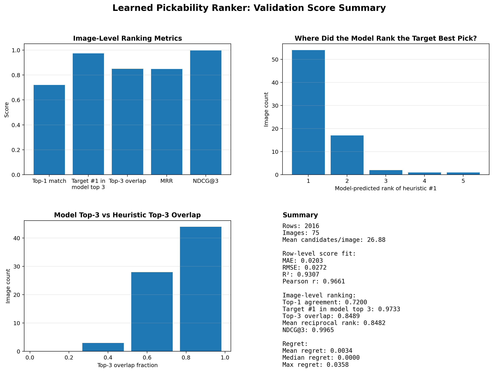
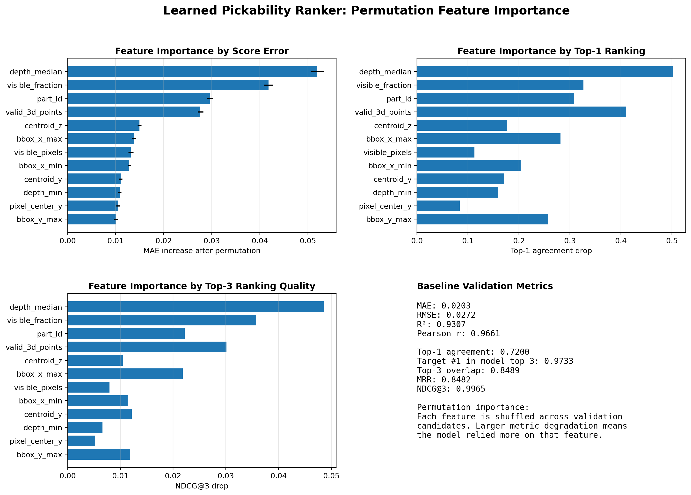
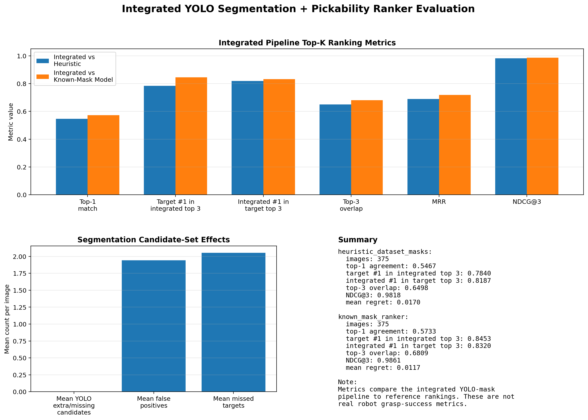

# Robotic Bin-Picking Perception: Technical Report

## Overview

This report summarizes a robotic bin-picking perception pipeline that combines visible instance segmentation, depth-based 3D geometry, heuristic candidate scoring, and a learned PyTorch pickability ranker.

The project evaluates three related systems:

1. **Heuristic ranking with dataset masks**: an interpretable pickability score computed from visible masks and depth-derived geometry.
2. **Known-mask learned ranker**: a PyTorch multilayer perceptron that uses the same dataset-mask features and predicts a learned pickability score.
3. **Integrated YOLO plus learned ranker**: YOLO predicts visible masks and part classes, features are extracted from the predicted masks, and the learned ranker scores the predicted candidates.

This separation makes it possible to evaluate the learned ranking model by itself, then evaluate the full integrated pipeline when predicted masks replace dataset masks.

## Pipeline

```text
RGB image
+ depth image
+ visible object masks or YOLO-predicted masks
+ camera intrinsics
→ object point clouds
→ object geometry features
→ heuristic or learned pickability score
→ ranked pick candidates
```

The geometry stage back-projects depth pixels inside each object mask into a point cloud. From each candidate point cloud, the pipeline computes centroid, median depth, depth range, approximate extents, valid 3D point count, image-space position, bounding-box features, and PCA orientation.

## Heuristic Ranking

The heuristic ranking is an interpretable baseline built from visual and geometric cues. Its components include visible area, visibility fraction, valid depth coverage, camera-relative depth, image position, and geometry confidence.

The heuristic creates a consistent training target for the learned ranker. It also provides a reference for evaluating whether the learned model preserves the same candidate ordering.

## Learned Pickability Model

The learned pickability model is a PyTorch multilayer perceptron trained to replace the heuristic score during inference. The model receives one object candidate at a time.

```text
object-level feature vector → PyTorch MLP → predicted pickability score
```

The model input contains object-level depth, geometry, visibility, image-position, bounding-box, and part-type features. It does not operate on raw RGB pixels alone. Each object candidate is represented as a feature vector derived from its mask and depth values.

The model output is a predicted pickability score. Within each image, all candidates are sorted by this predicted score to form the learned ranking.

The learned ranker is evaluated in two settings:

1. **Known-mask learned ranker**: the model receives features computed from dataset-provided visible masks.
2. **Integrated YOLO plus learned ranker**: the model receives features computed from YOLO-predicted masks.

This design shows whether ranking performance changes because of the learned ranker or because of upstream segmentation quality.

## Known-Mask Learned Ranker Evaluation

The learned ranker was first evaluated with dataset-provided visible masks. This isolates the ranking model from segmentation errors.

| Quantity | Value |
|---|---:|
| Object-candidate rows | 2016 |
| Validation images | 75 |
| Mean candidates per image | 26.88 |

### Score fit

| Metric | Value |
|---|---:|
| MAE | 0.0203 |
| RMSE | 0.0272 |
| R2 | 0.9307 |
| Pearson correlation | 0.9661 |

The learned ranker fits the heuristic score closely. The low MAE shows that candidate-level score predictions are close to the target. The R2 value of 0.9307 and Pearson correlation of 0.9661 show strong agreement between predicted scores and heuristic scores.

### Ranking metrics

| Metric | Value |
|---|---:|
| Top-1 agreement | 0.7200 |
| Heuristic #1 in model top 3 | 0.9733 |
| Mean top-3 overlap fraction | 0.8489 |
| Mean reciprocal rank | 0.8482 |
| NDCG@3 | 0.9965 |
| Mean regret | 0.0034 |

The exact top candidate matches the heuristic in 72 percent of validation images. The heuristic-best candidate appears in the model top 3 in 97.3 percent of images. NDCG@3 is 0.9965, which indicates that the model preserves the highest-value candidates even when nearby candidates change order.

The mean regret is 0.0034 on a 0 to 1 score scale. This means that most top-pick disagreements involve candidates with very similar heuristic quality.

<p align="center">
  
</p>

## Feature Importance

Permutation feature importance was used to measure which inputs the learned ranker relies on. Each feature was shuffled across validation candidates, then validation performance was recomputed. Larger degradation means the model used that feature more strongly.

<p align="center">
  
</p>

### Top features

| Rank | Feature | MAE Increase | Top-1 Drop | NDCG@3 Drop |
|---:|---|---:|---:|---:|
| 1 | `depth_median` | 0.0519 | 0.5020 | 0.0485 |
| 2 | `visible_fraction` | 0.0418 | 0.3267 | 0.0358 |
| 3 | `part_id` | 0.0296 | 0.3080 | 0.0222 |
| 4 | `valid_3d_points` | 0.0276 | 0.4100 | 0.0301 |
| 5 | `centroid_z` | 0.0150 | 0.1773 | 0.0105 |
| 6 | `bbox_x_max` | 0.0138 | 0.2813 | 0.0218 |
| 7 | `visible_pixels` | 0.0132 | 0.1127 | 0.0079 |
| 8 | `bbox_x_min` | 0.0129 | 0.2033 | 0.0114 |

The most important feature is `depth_median`. Shuffling this feature produces the largest increase in score error and the largest drop in exact top-pick agreement. This is consistent with the role of depth in bin picking, where object height and exposure are important for visual accessibility.

`visible_fraction` and `valid_3d_points` are also important. These features indicate whether the candidate has enough visible surface and usable depth to support reliable geometry extraction.

`part_id` also has strong importance. In this dataset, part ID corresponds to part type. Part type is related to shape, size, and geometry, so it acts as a part-shape prior rather than a meaningless numeric label.

## Segmentation Integration

The integrated pipeline adds Ultralytics YOLO as a visible instance segmentation stage. YOLO predicts visible masks and part classes. The predicted masks are passed through the same depth and geometry feature extraction pipeline, then scored by the learned pickability ranker.

YOLO inference settings for the integrated evaluation:

```text
confidence = 0.25
IoU threshold = 0.50
image size = 640
retina masks = enabled
```

Manual preview showed that `retina_masks=True` improved mask smoothness. Increasing inference resolution to 960 produced smoother masks but increased false-positive instance predictions. The 640 setting gave a better balance for the integrated evaluation.

## Integrated Pipeline Evaluation

The integrated YOLO plus ranker system was evaluated on 375 validation images. It was compared against both reference systems:

1. heuristic ranking with dataset masks
2. learned ranker with dataset masks

<p align="center">
  
</p>

### Integrated vs heuristic

| Metric | Value |
|---|---:|
| Images | 375 |
| Top-1 agreement | 0.5467 |
| Heuristic #1 in integrated top 3 | 0.7840 |
| Integrated #1 in heuristic top 3 | 0.8187 |
| Integrated #1 in heuristic top 5 | 0.9067 |
| Top-3 overlap | 0.6498 |
| NDCG@3 | 0.9818 |
| Mean regret | 0.0170 |

The integrated system matches the heuristic top pick in 54.7 percent of images. This exact-match metric is stricter than the rest of the evaluation because YOLO changes the available candidate masks.

The integrated top pick appears in the heuristic top 3 in 81.9 percent of images. The heuristic-best object appears in the integrated top 3 in 78.4 percent of images. These top-k results show that the integrated system usually selects from the same high-quality pick region, even when the exact first-ranked object changes.

NDCG@3 remains high at 0.9818. This indicates that the integrated top-3 ranking still preserves most of the heuristic candidate quality.

### Integrated vs known-mask learned ranker

| Metric | Value |
|---|---:|
| Images | 375 |
| Top-1 agreement | 0.5733 |
| Known-mask #1 in integrated top 3 | 0.8453 |
| Integrated #1 in known-mask top 3 | 0.8320 |
| Integrated #1 in known-mask top 5 | 0.8933 |
| Top-3 overlap | 0.6809 |
| NDCG@3 | 0.9861 |
| Mean regret | 0.0117 |

The comparison with the known-mask learned ranker is slightly stronger than the comparison with the heuristic. This is expected because both systems use the same learned ranker. The main difference is the mask source.

The integrated top pick appears in the known-mask ranker top 3 in 83.2 percent of images. The known-mask top pick appears in the integrated top 3 in 84.5 percent of images. NDCG@3 remains high at 0.9861, which shows that the integrated system generally keeps the learned ranker focused on similarly high-scoring candidates.

### Candidate-set effects

| Metric | Value |
|---|---:|
| Mean target candidates per image | 26.6 |
| Mean integrated candidates per image | 26.605 |
| Mean candidate count difference | 0.005 |
| Mean false-positive candidates at IoU 0.50 | 1.94 |
| Mean missed targets at IoU 0.50 | 2.05 |
| Mean matched IoU at threshold | 0.758 |
| Mean integrated top-pick IoU | 0.794 |

The average candidate count is nearly identical, but that hides the candidate-set changes introduced by segmentation. YOLO adds about 1.94 extra candidates and misses about 2.05 reference candidates per image at IoU 0.50. The mean matched IoU is 0.758, and the integrated top-pick IoU is 0.794.

These values show that the integrated model usually ranks candidates supported by reasonably aligned masks, but segmentation quality and candidate matching affect the final ordering.

## Final Integrated Examples

Each example below shows three panels:

1. heuristic ranking with dataset masks
2. learned ranker with dataset masks
3. integrated YOLO segmentation plus learned ranker

<p align="center">
  
</p>

<p align="center">
  
</p>

<p align="center">
  
</p>

<p align="center">
  
</p>

<p align="center">
  
</p>

## Conclusions

The learned ranker closely reproduces the heuristic target when using dataset-provided masks. It achieves strong score fit, high top-3 inclusion, high NDCG@3, and low regret. This shows that the object-level depth and geometry features carry enough information for a learned model to reproduce the pick-candidate ranking.

The integrated YOLO plus ranker pipeline produces a complete mask-prediction and pick-ranking workflow. Exact top-1 agreement is lower than the known-mask setting, but top-k metrics remain strong. The integrated top pick appears in the heuristic top 3 in 81.9 percent of images and in the known-mask ranker top 3 in 83.2 percent of images. This shows that the final integrated system usually selects a candidate from the same high-quality pick group.

The segmentation stage can be improved with more training data, threshold tuning, mask filtering, and candidate filtering. The current integrated evaluation provides a clear measurement of how predicted masks affect downstream ranking.

## References and Attribution

This project uses the XYZ Industrial Bin-Picking Dataset in BOP format. The dataset page lists the license as CC BY-NC-SA 4.0.

```bibtex
@article{huang2025xyzibd,
  title={XYZ-IBD: A High-precision Bin-picking Dataset for Object 6D Pose Estimation Capturing Real-world Industrial Complexity},
  author={Huang, Junwen and Liang, Jizhong and Hu, Jiaqi and Sundermeyer, Martin and Yu, Peter KT and Navab, Nassir and Busam, Benjamin},
  journal={arXiv preprint arXiv:2506.00599},
  year={2025}
}
```

The segmentation stage uses Ultralytics YOLO for visible instance segmentation.

```bibtex
@software{yolov8_ultralytics,
  author = {Glenn Jocher and Ayush Chaurasia and Jing Qiu},
  title = {Ultralytics YOLOv8},
  version = {8.0.0},
  year = {2023},
  url = {https://github.com/ultralytics/ultralytics},
  license = {AGPL-3.0}
}
```

The code and documentation created for this project are released under the MIT License. The dataset, YOLO package, and YOLO checkpoints remain governed by their own licenses.
